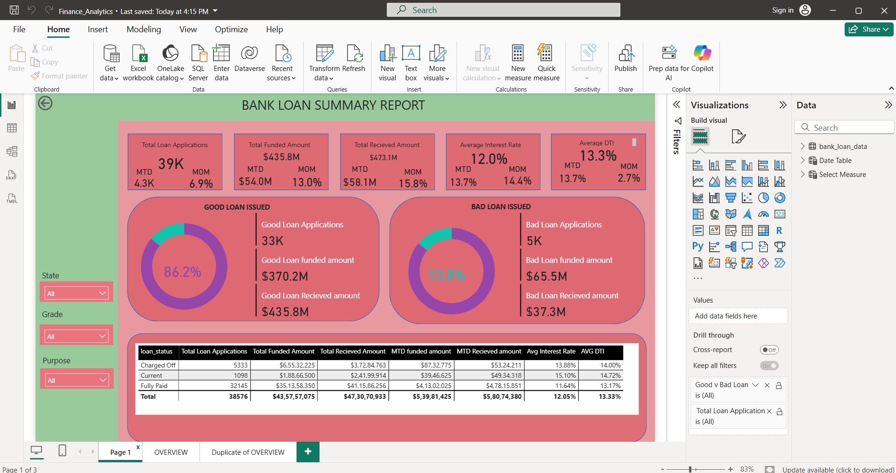
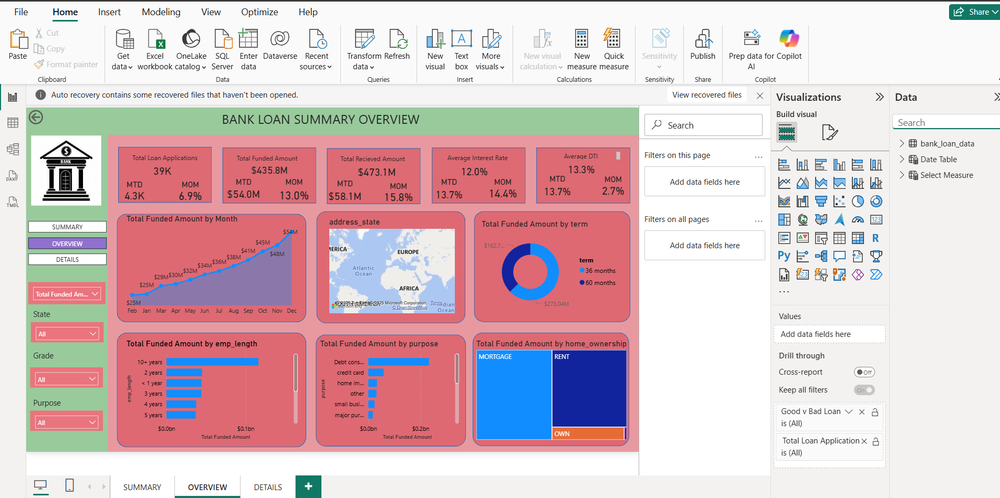

# 📊 Power BI Dashboard

## 📌 Project Description
This repository contains a **Power BI dashboard (.pbix file)** created to analyze and visualize data using interactive charts, KPIs, and filters.  
The dashboard helps users understand trends, compare metrics, and make data-driven decisions.

---

## 🎯 Objectives
- Convert raw data into meaningful insights  
- Track Key Performance Indicators (KPIs)  
- Enable interactive data exploration  
- Present information in a clear and visual format  

---

## 🛠 Tools & Technologies
- **Microsoft Power BI Desktop**
- **Power Query** – Data cleaning & transformation
- **DAX** – Measures and calculated fields
- **Data Visualization** – Charts, tables, KPIs, slicers

---

## 📂 Repository Contents
| File | Description |
|------|------------|
| `dashboard.pbix` | Power BI dashboard file |
| `README.md` | Project documentation |
| `images/` | Dashboard screenshots |

---

## 📊 Dashboard Features
- KPI cards for quick insights  
- Interactive charts and graphs  
- Slicers and filters for dynamic analysis  
- Drill-down and cross-filtering  
- Clean and user-friendly layout  

---

## 📈 Insights Provided
- Performance trends over time  
- Category-wise and segment-wise analysis  
- Comparison of key metrics  
- Identification of top and bottom performers  

---

## 🔄 Data Preparation Steps
1. Data imported into Power BI  
2. Data cleaned and transformed using Power Query  
3. Measures and KPIs created using DAX  
4. Visuals designed and arranged into a dashboard  
5. Filters and interactions applied  

---

## 🚀 How to Use
1. Download the `.pbix` file  
2. Open it in **Microsoft Power BI Desktop**  
3. Refresh the data if required  
4. Use slicers and visuals to explore insights  

---

## 🖼 Dashboard Preview

### 📊 Screenshot 1: Dashboard Overview

### 📈 Screenshot 2: KPI & Trend Analysis

---

## 💡 Notes
- Screenshots are stored in the `images/` folder  
- Use **PNG or JPG** format for best clarity  
- File names should not contain spaces  

---

## ⭐ Acknowledgement
If you found this project useful, consider giving the repository a ⭐.

